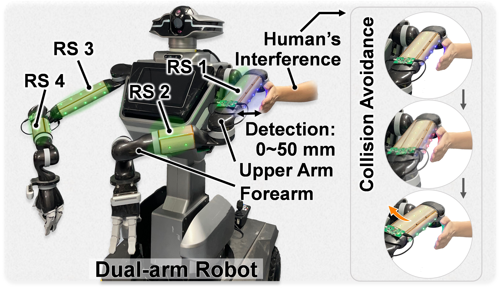
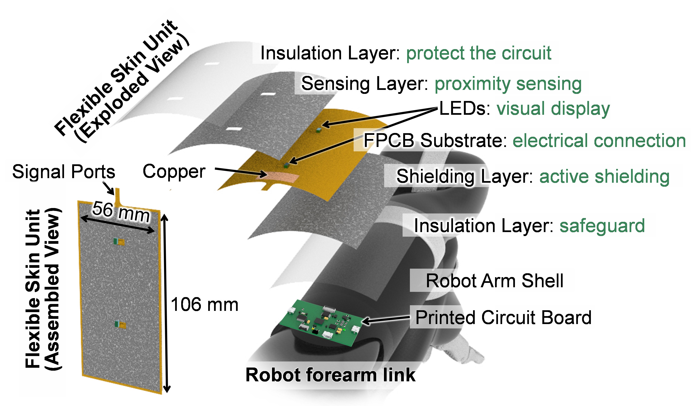

<section id="about">
  <h2 style="display:flex;align-items:center;gap:8px;line-height:1;padding-bottom:2px;position:relative;"><svg width="50" height="26" viewBox="0 0 50 26" style="vertical-align:middle;"><polygon points="0,0 22,0 36,26 0,26" fill="#1e4e8c"/><polygon points="22,0 33,0 44,26 33,26" fill="#50a6f1ff"/></svg>About Me</h2>

  

    Hello, I'm Ruohan.
  

  

    I'm currently pursuing my Ph.D. in <a href="http://www.fsie-zju.com/" target="_blank" style="color: rgba(0, 0, 0, 1); font-weight: bold;font-family: 'Georgia'">FSII</a>, the Laboratory of Flexible Sensors and Intelligent Interaction Mechatronic Engineering at Zhejiang University Hangzhou, China, under the supervision of <a href="https://person.zju.edu.cn/gengy" target="_blank" style="color: rgba(0, 0, 0, 1); font-weight: bold;font-family: 'Georgia'">Prof. Geng Yang</a>.
  

  

    My research interests center on Safety in Human–Robot Interaction, Robot Teleoperation, Shared Control, and Wearable Exoskeleton. I aim to build intuitive and safe robotic systems that seamlessly collaborate with humans.
  

</section>

<section id="news">
  <h2 style="display:flex;align-items:center;gap:8px;line-height:1;padding-bottom:2px;position:relative;"><svg width="50" height="26" viewBox="0 0 50 26" style="vertical-align:middle;"><polygon points="0,0 22,0 36,26 0,26" fill="#1e4e8c"/><polygon points="22,0 33,0 44,26 33,26" fill="#50a6f1ff"/></svg>News</h2>
  <ul id="news-list">
    <li>2025-07: Our paper has recevied  IEEE IES Students & Young Professionals Assistance Awrad in <a href="https://indin2025.ieee-ies.org/#/home" style="color: #1e4e8c; font-weight: bold;font-family: 'Georgia'" target="_blank">INDIN 2025</a>.</li>
    <li>2025-06: Paper accepted by <a href="https://www.iros25.org/" style="color: #1e4e8c; font-weight: bold;font-family: 'Georgia'" target="_blank">IROS 2025</a> on robot shared control.</li>
    <li>2024-09: I won the honor of Outstanding Graduate Student in 2023-2024 semester.</li>
    <li>2024-08:  We won the  Second Prize  in <i>Mingshi Cup</i>, the 5th Wiener Sensing Technology and Intelligent Application Competition.</li>
    <li>2024-06: Our paper has recevied  IEEE IES Students & Young Professionals Assistance Awrad in <a href="https://ieee-isie-2024.org/" style="color: #1e4e8c; font-weight: bold;font-family: 'Georgia'" target="_blank">ISIE 2024</a>.</li>
    <li>2024-06:  We won the  First Prize  of Hangzhou and Xiamen Region in <i>Huawei Light Chaser</i>, the Embedded Software Design Competition.</li>
    <li>2023-09: I won the honor of Outstanding Graduate Student in 2022-2023 semester.</li>
    <li>2023-08:  We won the  First Prize  in <i>Zhaoyi Innovation Cup</i>, the 18th China Postgraduate Electronic Design Competition.</li>
    <li>2023-06:  We won the  First Prize  of Hangzhou and Xiamen Region in <i>Huawei Light Chaser</i>, the Embedded Software Design Competition.</li>
    <li>2022-09: I won the honor of Outstanding Graduate Student in 2021-2022 semester.</li>
    <li>2022-09:  I won the  Jiancheng Scholarship of Zhejiang University in 2021-2022 semester.</li>
    <li>2022-08:  We won the  First Prize  in <i>Shenhao Cup</i>,  the 4th Graduate Student Robotics Competition.</li>
    <li>2022-08:  We won the  Second Prize  in <i>Mingshi Cup</i>, the 3rd Wiener Sensing Technology and Intelligent Application Competition.</li>
    <li>2022-02:  We won the  Sliver Award  in the 48th Geneva International Exhibition of Inventions Competition.</li>
    <li>2021-12:  I won the  Huaneng Scholarship of Zhejiang University.</li>
    <li>2021-12:  We won the  Gold Award  in <i>Huachen Cup</i>, the 2nd National Machinery Industry Design Innovation Competition.</li>
    <li id="toggle-news" class="toggle-item">[Show More]</li>
  </ul>
</section>

<section id="publications">
  <h2 style="display:flex;align-items:center;gap:8px;line-height:1;padding-bottom:2px;position:relative;"><svg width="50" height="26" viewBox="0 0 50 26" style="vertical-align:middle;"><polygon points="0,0 22,0 36,26 0,26" fill="#1e4e8c"/><polygon points="22,0 33,0 44,26 33,26" fill="#50a6f1ff"/></svg>Publications</h2>

  <h3>Journal</h3>
  <ol>
    <li>[1] <b>Ruohan Wang</b>, Honghao Lyu, Zhengjie Zhu, et.al., 
        Safety-Aware Shared Control for Teleoperated Robotic Precision Tasks under Dynamic Interference, <i>IEEE Robotics and Automation Letters</i>, vol. 10, no. 9, pp. 9328-9335, 2025. <a href="https://ieeexplore.ieee.org/document/11091461" target="_blank" style="color: rgba(74, 152, 230, 1); font-weight: bold;">[LINK]</a>
    </li>
    <li>[2] <b>Ruohan Wang</b>, Ying Yang, ZhengJie Zhu, et. al., 
        A Proactive Safety Architecture Based on Proximity Sensing for Enhanced Human-Robot Interaction in Tele-Homecare, Submit to <i>IEEE Transactions on Human-Machine Systems</i>, In press, 2025.
    </li>
    <li>[3] <b>Ruohan Wang</b>, Chen Li, Honghao Lv, Gaoyang Pang, Haiteng Wu, and Geng Yang, 
        "A Smooth Velocity Transition Framework Based on Hierarchical Proximity Sensing for Safe Human-Robot Interaction," <i>IEEE Robotics and Automation Letters</i>, vol. 9, no. 6, pp. 4910-4917, 2024. <a href="https://ieeexplore.ieee.org/document/10493076" target="_blank" style="color: rgba(74, 152, 230, 1); font-weight: bold;">[LINK]</a>
    </li>
    <li>[4] <b>Ruohan Wang†</b>, Honghao Lv†, Zhangli Lu, Xiaoyan Huang, Haiteng Wu, Junjie Xiong, Geng Yang*, 
        “A medical assistive robot for tele-healthcare during the COVID-19 pandemic: development and usability study in an isolation ward,” <i>JMIR Human Factors</i>, vol. 10, art. no. e42870, Jan. 2023.<a href="https://humanfactors.jmir.org/2023/1/e42870" target="_blank" style="color: rgba(74, 152, 230, 1); font-weight: bold;">[LINK]</a>
    </li>
    <li>[5] Yuyao Lu†, Depeng Kong†, Geng Yang*, <b>Ruohan Wang</b>, Gaoyang Pang, Huayu Luo, Huayong Yang, Kaichen Xu*, 
        “Machine Learning-Enabled Tactile Sensor Design for Dynamic Touch Decoding,” <i>Advanced Science</i>, 2023: 2303949.<a href="https://advanced.onlinelibrary.wiley.com/doi/10.1002/advs.202303949" target="_blank" style="color: rgba(74, 152, 230, 1); font-weight: bold;">[LINK]</a>
    </li>
    <li>[6] Huiying Zhou, Honghao Lv, <b>Ruohan Wang</b>, Haiteng Wu, Geng Yang*, 
        “Revitalizing Human-Robot Interaction: Phygital Twin Driven Robot Avatar for China–Sweden Teleoperation,” <i>Chinese Journal of Mechanical Engineering</i>, 36, 124 (2023).<a href="https://cjme.springeropen.com/articles/10.1186/s10033-023-00956-9" target="_blank" style="color: rgba(74, 152, 230, 1); font-weight: bold;">[LINK]</a>
    </li>
    <li>[7] Huiying Zhou, Geng Yang, Baicun Wang*, Lingyu Li, <b>Ruohan Wang</b>, Xiaoyan Huang, Haiteng Wu, and Xi Vincent Wang, 
        “An attention-based deep learning approach for inertial motion recognition and estimation in human-robot collaboration,” <i>Journal of Manufacturing Systems</i>, Volume 67, Pages 97-110, DOI: 10.1016/j.jmsy.2023.01.007, Apr. 2023.<a href="https://www.sciencedirect.com/science/article/pii/S0278612523000195" target="_blank" style="color: rgba(74, 152, 230, 1); font-weight: bold;">[LINK]</a>
    </li>
    <li>[8] Geng Yang, Zhiqiu Ye, Haiteng Wu, Chen Li, <b>Ruohan Wang</b>, Depeng Kong, Zeyang Hou, Huafen Wang, Xiaoyan Huang, Zhibo Pang, Na Dong, and Gaoyang Pang*, 
        “A Digital Twin Based Large-Area Robot Skin System for Safer Human-Centered Healthcare Robots Toward Healthcare 4.0,” <i>IEEE Transactions on Medical Robotics and Bionics</i>, vol. 6, no. 3, pp. 1104–1115, 2024.<a href="https://ieeexplore.ieee.org/document/10579909" target="_blank" style="color: rgba(74, 152, 230, 1); font-weight: bold;">[LINK]</a>
    </li>
    <li>[9] Kaichen Xu, Qi’ao Li, Yuyao Lu, Huayu Luo, Yihui Jian, Dingwei Li, Depeng Kong, <b>Ruohan Wang</b>, Jibing Tan, Zimo Cai, Geng Yang, Bowen Zhu, Qingqing Ye, Huayong Yang, and Tiefeng Li, 
        “Laser Direct Writing of Flexible Thermal Flow Sensors,” <i>Nano Letters</i>, pp. 10317-10325, 2023.<a href="https://pubs.acs.org/doi/10.1021/acs.nanolett.3c02891" target="_blank" style="color: rgba(74, 152, 230, 1); font-weight: bold;">[LINK]</a>
    </li>
  </ol>

  <h3>Conference</h3>
  <ol>
    <li>[1] <b>Ruohan Wang</b>, Guangwei Zhang, Zhengjie Zhu, et.al., 
        Advancing Robot Interaction Safety: A Teleoperated Shared-Control Approach Using a Lightweight Force-Feedback Exoskeleton, <i>IEEE/RSJ International Conference on Intelligent Robots and Systems <b>(IROS 2025)</b></i>, In press, 2025.
    </li>
    <li>[2] <b>Ruohan Wang</b>, et al., 
        “Towards Immersive Teleoperation: Dynamic Identification for Force Feedback of a Wearable Exoskeleton,” in the <i>7th IFToMM Asian Mechanisms and Machine Science Conference <b>(Asian MMS 2024)</b></i>, Almaty, Kazakhstan, 28-30 Aug. 2024. (the Silver Best Student Paper Award)<a href="https://link.springer.com/chapter/10.1007/978-3-031-67569-0_9" target="_blank" style="color: rgba(74, 152, 230, 1); font-weight: bold;">[LINK]</a>
    </li>
    <li>[3] <b>Ruohan Wang</b>, Xi Cui, Honghao Lv, Guangyao Zhang, Haiteng Wu, and Geng Yang, 
        “Enable Intuitive and Immersive Teleoperation: Design, Modeling and Control of a Novel Wearable Exoskeleton,” in the <i> 16th International Conference on Intelligent Robotics and Applications<b>(ICIRA 2023)</b></i>, Hangzhou, China, 05-07 Jul. 2023.<a href="https://link.springer.com/chapter/10.1007/978-981-99-6486-4_17" target="_blank" style="color: rgba(74, 152, 230, 1); font-weight: bold;">[LINK]</a>
    </li>
    <li>[4] Guangwei Zhang, <b>Ruohan Wang</b>, Mengke Wang, Honghao Lyu*, Dapeng Lan, Dashun Zhang, and Geng Yang, 
        “Wearable Exoskeleton-Based Immersive Teleoperation for Industrial Manufacturing Systems: Hardware Design and Verification,” in the <i>23rd IEEE International Conference on Industrial Informatics <b>(INDIN 2025)</b></i>, Kunming, China, 12-15 July, 2025. (IEEE IES Students & Young Professionals Assistance Awrad – IES-SYPA Award)
    </li>
    <li>[5] Lei Wang, <b>Ruohan Wang</b>, Honghao Lv, et. al., 
        Liberating Humanity from Heavy Labor: Dual-Arm Coordination and Teleoperation Control for an Assistive Robot,  in the <i>IEEE 33rd International Symposium on Industrial Electronics <b>(ISIE 2024)</b></i>, Ulsan, Korea, Republic of, 18-21 Jun. 2024. (IEEE IES Students & Young Professionals Assistance Awrad – IES-SYPA Award)<a href="https://ieeexplore.ieee.org/abstract/document/10595726" target="_blank" style="color: rgba(74, 152, 230, 1); font-weight: bold;">[LINK]</a>
    </li>
    <li>[6] Ying Yang, Chen Li, <b>Ruohan Wang</b>, et. al., 
        Design of Highly Integrated Microscale Fingertip Tactile Sensor for Robot Dexterous Hand, in the <i>17th International Conference on Intelligent Robotics and Applications <b>(ICIRA 2024)</b></i>, Xi’an, China, 31 Jul. – 02 Aug. 2024.<a href="https://link.springer.com/chapter/10.1007/978-981-96-0780-8_20" target="_blank" style="color: rgba(74, 152, 230, 1); font-weight: bold;">[LINK]</a>
    </li>
    <li>[7] Guangwei Zhang, <b>Ruohan Wang</b>, Honghao Lv, et. al., 
        Design and Control of a Wearable Upper-Limb Exoskeleton Featuring Force Feedback for Teleoperation, in the <i>17th International Conference on Intelligent Robotics and Applications <b>(ICIRA 2024)</b></i>, Xi’an, China, 31 Jul. – 02 Aug. 2024.<a href="https://link.springer.com/chapter/10.1007/978-981-96-0780-8_18" target="_blank" style="color: rgba(74, 152, 230, 1); font-weight: bold;">[LINK]</a>
    </li>
    <li>[8] Mengke Wang, Honghao Lv, <b>Ruohan Wang</b>, et. al., 
        Enhancing Robot Teleoperation in Remote Automation Production through an Event-Triggered Control Strategy, in the <i>IEEE 33rd International Symposium on Industrial Electronics <b>(ISIE 2024)</b></i>, Ulsan, Korea, Republic of, 18-21 Jun. 2024.<a href="https://ieeexplore.ieee.org/abstract/document/10595681" target="_blank" style="color: rgba(74, 152, 230, 1); font-weight: bold;">[LINK]</a>
    </li>
    <li>[9] Honghao Lv, Huiying Zhou, <b>Ruohan Wang</b>, Haiteng Wu, Zhibo Pang, and Geng Yang, 
        “Towards Intercontinental Teleoperation: A Cloud-Based Framework for Ultra-Remote Human-Robot Dual-Arm Motion Mapping,” in the <i>16th International Conference on Intelligent Robotics and Applications <b>(ICIRA 2023)</b></i>, Hangzhou, China, 05-07 Jul. 2023.<a href="https://link.springer.com/chapter/10.1007/978-981-99-6498-7_12" target="_blank" style="color: rgba(74, 152, 230, 1); font-weight: bold;">[LINK]</a>
    </li>
    <li>[10] Longqiang Wang, <b>Ruohan Wang</b>, Haiteng Wu, and Geng Yang, 
        “Keeping Workers Safe in Electric Working: A Robot System for High-Voltage Live Operation,” in the <i>IEEE International Conference on Industrial Technology <b>(ICIT 2023)</b></i>, Orlando, FL, USA, 04-06 Apr. 2023.<a href="https://ieeexplore.ieee.org/document/10143040" target="_blank" style="color: rgba(74, 152, 230, 1); font-weight: bold;">[LINK]</a>
    </li>
  </ol>
</section>

<section id="cv">
  <h2 style="display:flex;align-items:center;gap:8px;line-height:1;padding-bottom:2px;position:relative;"><svg width="50" height="26" viewBox="0 0 50 26" style="vertical-align:middle;"><polygon points="0,0 22,0 36,26 0,26" fill="#1e4e8c"/><polygon points="22,0 33,0 44,26 33,26" fill="#50a6f1ff"/></svg>Curriculum Vitae</h2>
  

    <ol><li> See <a href="https://wang-ruohan.github.io/ruohan.github.io/files/RuohanWang_CV_240512.pdf" target="_blank">Ruohan-CV240512 (PDF)</a></li></ol>
  

  <h3>Education</h3>
  <ul>
    <li> <b>2021-Now</b>, Ph.D. in School of Mechanical Engineering, Zhejiang University.</li>
    <li> <b>2017-2021</b>, B.Eng. in School of Mechanical and Electronic Control Engineering，Beijing Jiaotong University. </li>
  </ul>
</section>

<section id="projects">
  <h2 style="display:flex;align-items:center;gap:8px;line-height:1;padding-bottom:2px;position:relative;"><svg width="50" height="26" viewBox="0 0 50 26" style="vertical-align:middle;"><polygon points="0,0 22,0 36,26 0,26" fill="#1e4e8c"/><polygon points="22,0 33,0 44,26 33,26" fill="#50a6f1ff"/></svg>Projects</h2>
  <h3>Advancing Teleoperated Robot's Interaction Safety</h3>
  <ol>
    <li>This project develops a teleoperated shared-control framework for homecare robots using a lightweight exoskeleton. Operator commands are combined with real-time proximity sensing to avoid collisions, while force feedback allows intuitive perception of contacts. Comparative experiments demonstrate that this strategy effectively enhances safety and reliability in tele-homecare scenarios. <a href="https://" target="_blank" style="color: rgba(74, 152, 230, 1); font-weight: bold;">[PAPER]</a></li>
    <li> <b>Keywords</b>: Robot Interaction Safety, Teleoperation, Wearable Exoskeleton, Force Feedback, Shared Control</li>
  </ol>

  

    <!-- 视频或图片1 -->
    

      <video src="videos/IROS2025-video1.mp4" controls></video>
      
Exoskeleton for Teleoperation

    

    <!-- 视频或图片2 -->
    

      <video src="videos/IROS2025-video2.mp4" controls></video>
      
Robot Shared Control

    

    <!-- 视频或图片3 -->
    

      <video src="videos/IROS2025-video3.mp4" controls></video>
      
Robot Shared Control

    

  

  <h3>Robot Needle Threading Under Dynamic Interference</h3>
  <ol>
    <li>This project develops a safety-aware shared control strategy for teleoperated robotic arms. It combines proximity sensing and force feedback guidance, enabling the robot to anticipate potential collisions, switch to a compliant mode to reduce impact, and maintain precise, stable operation. Experiments show that under dynamic interference, this approach significantly reduces contact force (up to 78.81%) and improves tracking accuracy (up to 66.91%). <a href="https://ieeexplore.ieee.org/document/11091461" target="_blank" style="color: rgba(74, 152, 230, 1); font-weight: bold;">[PAPER1]</a> <a href="https://" target="_blank" style="color: rgba(74, 152, 230, 1); font-weight: bold;">[PAPER2]</a></li>
    <li> <b>Keywords</b>: Proximity Sensing, Robot Teleoperation, Safety Aware, Shared Control</li>
  </ol>

  

    
    
Human-Behavior-Inspired Shared Control Strategy

  

  

    

      <video src="videos/RAL2-video1.mp4"
            controls
            style="width:940px; height:auto;"></video>
      
Needle Threading Under Random Interference

    

  

  <h3>Proximity-Sensing Based Safe Human-Robot Interaction</h3>
  <ol>
    <li>This project develops a capacitive robot skin integrated with a smooth velocity transition framework to enhance human-robot safety in Industry 5.0. The skin covers a large area of a 6-DOF robot arm and uses a hierarchical proximity sensing method to grade distance and generate smooth collision-avoidance velocities. Tested in a pick-and-place scenario, the approach reduces sudden acceleration compared to traditional threshold methods, enabling safer and more natural human-robot interaction. <a href="https://ieeexplore.ieee.org/document/10493076" target="_blank" style="color: rgba(74, 152, 230, 1); font-weight: bold;">[PAPER]</a></li>
    <li> <b>Keywords</b>: Human-Robot Interaction, Industry 5.0, Robot Skin, the Safety of Humans, Smooth Velocity Transition Framework.</li>
  </ol>

  

    

      <video src="videos/RAL1-video1.mp4"
            controls 
            style="width:520px; height:auto;"></video>
      
Exoskeleton for Teleoperation

    

    

      
      
Overall Framework

    

    

      
      
Capacitive Sensor

    

  

</section>

<section id="talks">
  <h2 style="display:flex;align-items:center;gap:8px;line-height:1;padding-bottom:2px;position:relative;"><svg width="50" height="26" viewBox="0 0 50 26" style="vertical-align:middle;"><polygon points="0,0 22,0 36,26 0,26" fill="#1e4e8c"/><polygon points="22,0 33,0 44,26 33,26" fill="#50a6f1ff"/></svg>Records</h2>
  <ul>
    <li><b>2025</b>: <i>Safe Teleoperation for Homecare Robots</i>, Invited Talk at International Robotics Symposium.</li>
    <li><b>2024</b>: <i>Task-Adaptive Grasping with Dual-Arm Robots</i>, Seminar at [University].</li>
    <li><b>2023</b>: <i>Robotic Perception in Assistive Scenarios</i>, Guest Lecture at [Conference].</li>
  </ul>
</section>
